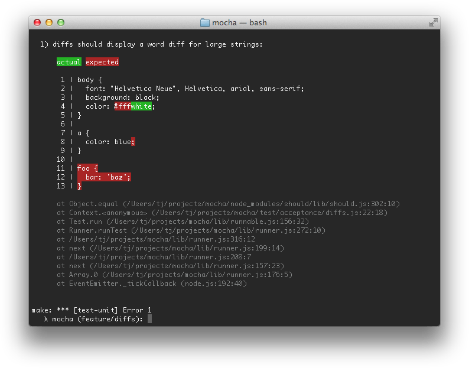

Mocha supports the `err.expected` and `err.actual` properties of any thrown `AssertionError`s from an assertion library.
Mocha will attempt to display the difference between what was expected and what the assertion actually saw.
Here's an example of a "string" diff using `--inline-diffs`:

