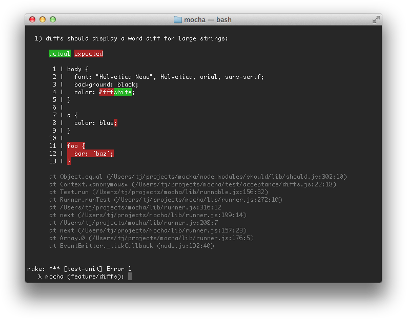

## Timeouts

### Suite-level

Suite-level timeouts may be applied to entire test "suites", or disabled via `this.timeout(0)`.
This will be inherited by all nested suites and test-cases that do not override the value.

```js
describe("a suite of tests", function () {
  this.timeout(500);

  it("should take less than 500ms", function (done) {
    setTimeout(done, 300);
  });

  it("should take less than 500ms as well", function (done) {
    setTimeout(done, 250);
  });
});
```

### Test-level

Test-specific timeouts may also be applied, or the use of `this.timeout(0)` to disable timeouts all together:

```js
it("should take less than 500ms", function (done) {
  this.timeout(500);
  setTimeout(done, 300);
});
```

### Hook-level

Hook-level timeouts may also be applied:

```js
describe("a suite of tests", function () {
  beforeEach(function (done) {
    this.timeout(3000); // A very long environment setup.
    setTimeout(done, 2500);
  });
});
```

Again, use `this.timeout(0)` to disable the timeout for a hook.

:::note
In v3.0.0 or newer, a parameter passed to `this.timeout()` greater than the [maximum delay value](https://developer.mozilla.org/docs/Web/API/WindowTimers/setTimeout#Maximum_delay_value) will cause the timeout to be disabled.
:::
:::note
In v8.0.0 or newer, `this.enableTimeouts()` has been removed.
:::

:::caution
With async tests if you disable timeouts via `this.timeout(0)` and then do not call `done()`, your test will exit silently.
:::

## Diffs

Mocha supports the `err.expected` and `err.actual` properties of any thrown `AssertionError`s from an assertion library.
Mocha will attempt to display the difference between what was expected, and what the assertion actually saw.
Here's an example of a "string" diff using `--inline-diffs`:


