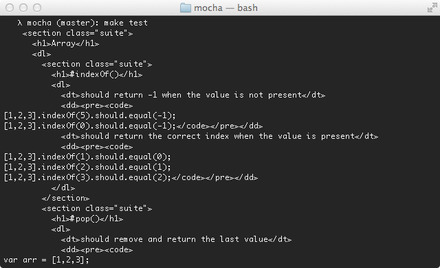

Alias: `Doc`, `doc`

The Doc reporter outputs a hierarchical HTML body representation of your tests.
Wrap it with a header, footer, and some styling, then you have some fantastic documentation!



For example, suppose you have the following JavaScript:

```js
describe("Array", function () {
  describe("#indexOf()", function () {
    it("should return -1 when the value is not present", function () {
      [1, 2, 3].indexOf(5).should.equal(-1);
      [1, 2, 3].indexOf(0).should.equal(-1);
    });
  });
});
```

The command `mocha --reporter doc array` would yield:

```html
<section class="suite">
  <h1>Array</h1>
  <dl>
    <section class="suite">
      <h1>#indexOf()</h1>
      <dl>
        <dt>should return -1 when the value is not present</dt>
        <dd>
          <pre><code>[1,2,3].indexOf(5).should.equal(-1);
[1,2,3].indexOf(0).should.equal(-1);</code></pre>
        </dd>
      </dl>
    </section>
  </dl>
</section>
```

The SuperAgent request library [test documentation](https://ladjs.github.io/superagent/docs/test.html) was generated with Mocha's doc reporter using this Bash command:

```bash
$ mocha --reporter=doc | cat docs/head.html - docs/tail.html > docs/test.html
```

View SuperAgent's [Makefile](https://github.com/visionmedia/superagent/blob/master/Makefile) for reference.
