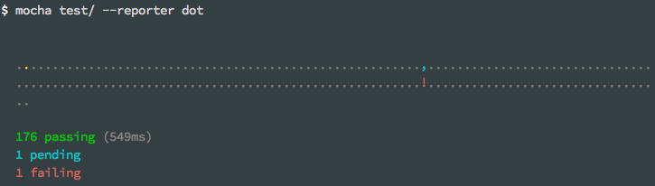

Alias: `Dot`, `dot`

The Dot Matrix reporter is a series of characters which represent test cases.
Failures highlight in red exclamation marks (`!`), pending tests with a blue comma (`,`), and slow tests as yellow.
Good if you prefer minimal output.

