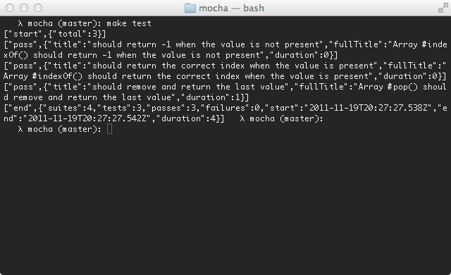

Alias: `JSONStream`, `json-stream`

The JSON Stream reporter outputs newline-delimited JSON "events" as they occur, beginning with a "start" event, followed by test passes or failures, and then the final "end" event.

