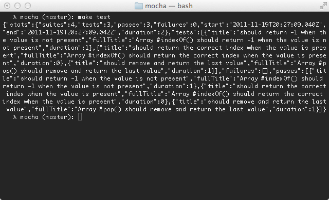

Alias: `JSON`, `json`

The JSON reporter outputs a single large JSON object when the tests have completed (failures or not).

By default, it will output to the console.
To write directly to a file, use `--reporter-option output=filename.json`.

