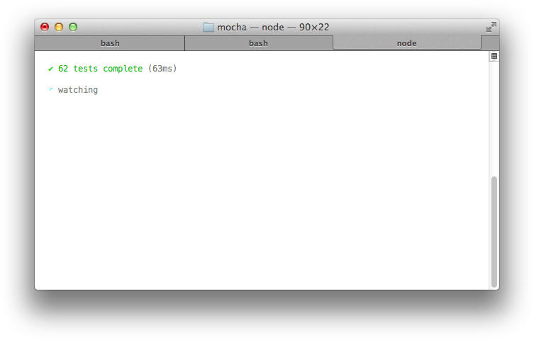

Alias: `Min`, `min`

The Min reporter displays the summary only, while still outputting errors on failure.
This reporter works great with `--watch` as it clears the terminal in order to keep your test summary at the top.

