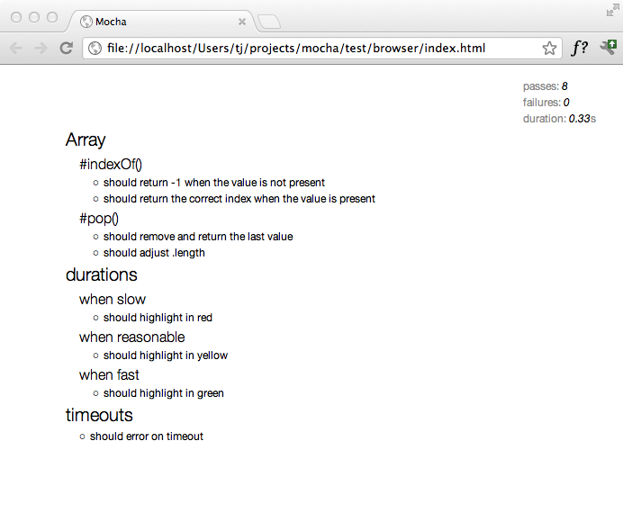

Mocha runs in the browser.
Every release of Mocha will have new builds of `./mocha.js` and `./mocha.css` for use in the browser.

A typical setup might look something like the following, where we call `mocha.setup('bdd')` to use the **BDD** interface before loading the test scripts, running them `onload` with `mocha.run()`.

```html
<!doctype html>
<html lang="en">
  <head>
    <meta charset="utf-8" />
    <title>Mocha Tests</title>
    <meta name="viewport" content="width=device-width, initial-scale=1.0" />
    <link rel="stylesheet" href="https://unpkg.com/mocha/mocha.css" />
  </head>
  <body>
    <div id="mocha"></div>

    <script src="https://unpkg.com/chai@4/chai.js"></script>
    <script src="https://unpkg.com/mocha/mocha.js"></script>

    <script class="mocha-init">
      mocha.setup("bdd");
      mocha.checkLeaks();
    </script>
    <script src="test.array.js"></script>
    <script src="test.object.js"></script>
    <script src="test.xhr.js"></script>
    <script class="mocha-exec">
      mocha.run();
    </script>
  </body>
</html>
```

## Grep

The browser may use the `--grep` as functionality.
Append a query-string to your URL: `?grep=api`.

## Browser Configuration

Mocha options can be set via `mocha.setup()`.
Examples:

```js
// Use "tdd" interface.  This is a shortcut to setting the interface;
// any other options must be passed via an object.
mocha.setup('tdd');

// This is equivalent to the above.
mocha.setup({
  ui: 'tdd'
});

// Examples of options:
mocha.setup({
  allowUncaught: true,
  asyncOnly: true,
  bail: true,
  checkLeaks: true,
  dryRun: true,
  failZero: true,
  forbidOnly: true,
  forbidPending: true,
  global: ['MyLib'],
  retries: 3,
  rootHooks: { beforeEach(done) { ... done();} },
  slow: '100',
  timeout: '2000',
  ui: 'bdd'
});
```

## Browser-Specific Options

Browser Mocha supports many, but not all [CLI options](./configuring).
To use a CLI option that contains a "-", please convert the option to camelCase, (eg. `check-leaks` to `checkLeaks`).

### Options That Differ Slightly From [CLI Options](./configuring)

> `reporter` _`string|constructor`_

You can pass a reporter's name or a custom reporter's constructor.
You can find **recommended** reporters for the browser [here](#reporting).

It is possible to use [built-in reporters](../reporters/spec) as well.
Their employment in browsers is neither recommended nor supported, open the console to see the test results.

### Options That _Only_ Function In Browser Context

> `noHighlighting` _`boolean`_

If set to `true`, do not attempt to use syntax highlighting on output test code.

## Reporting

The HTML reporter is the default reporter when running Mocha in the browser.
It looks like this:



[Mochawesome](https://npm.im/mochawesome) is a great alternative to the default HTML reporter.
