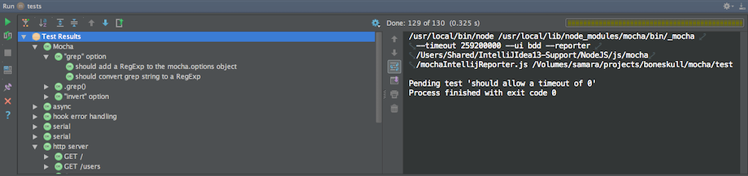
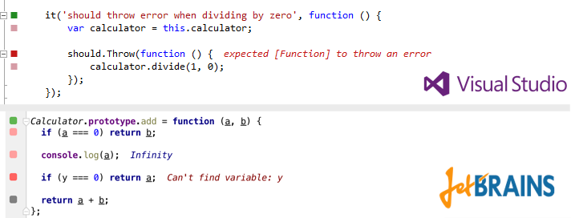
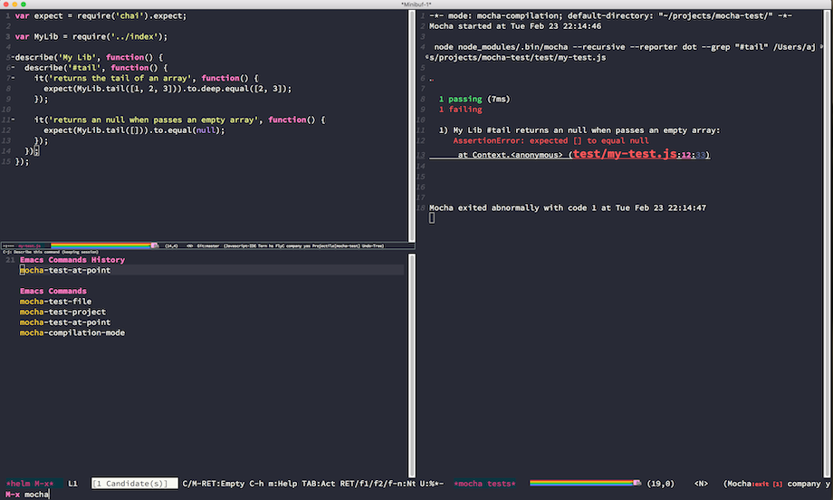
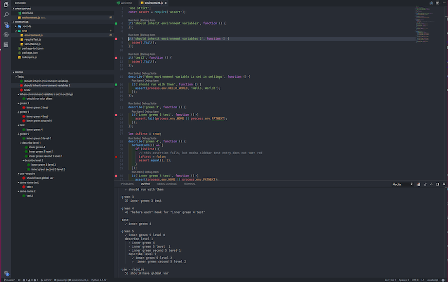

The following editor-related packages are available:

### TextMate

The [Mocha TextMate bundle](https://github.com/mochajs/mocha.tmbundle) includes snippets to make writing tests quicker and more enjoyable.

### JetBrains

[JetBrains](https://www.jetbrains.com) provides a [NodeJS plugin](https://plugins.jetbrains.com/plugin/6098-node-js) for its suite of IDEs (IntelliJ IDEA, WebStorm, etc.), which contains a Mocha test runner, among other things.

The plugin is titled **NodeJS**, and can be installed via **Preferences** > **Plugins**, assuming your license allows it.

### Wallaby.js

[Wallaby.js](https://wallabyjs.com) is a continuous testing tool that enables real-time code coverage for Mocha with any assertion library in VS Code, Atom, JetBrains IDEs (IntelliJ IDEA, WebStorm, etc.), Sublime Text and Visual Studio for both browser and node.js projects.

### Emacs

[Emacs](https://www.gnu.org/software/emacs) support for running Mocha tests is available via a 3rd party package [mocha.el](https://github.com/scottaj/mocha.el).
The package is available on MELPA, and can be installed via `M-x package-install mocha`.

### Mocha Sidebar (VS Code)

[Mocha sidebar](https://marketplace.visualstudio.com/items?itemName=maty.vscode-mocha-sidebar) is the most complete mocha extension for vs code.

#### Features

- see all tests in VS Code sidebar menu
- run & debug tests for each level hierarchy from all tests to a single test (and each suite)
- auto run tests on file save
- see tests results directly in the code editor

