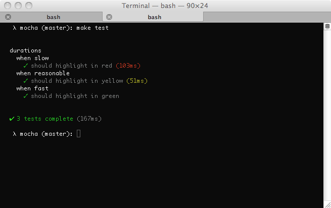

Many reporters will display test duration and flag tests that are slow (default: 75ms), as shown here with the SPEC reporter:



There are three levels of test duration (depicted in the following image):

1. FAST: Tests that run within the "fast" threshold will show the duration in green (if at all).
2. NORMAL: Tests that run exceeding the "fast" threshold (but still within the "slow" threshold) will show the duration in yellow.
3. SLOW: Tests that run exceeding the "slow" threshold will show the duration in red.

By default, the "fast" threshold is half of the "slow" threshold.


To tweak what's considered "slow", you can use the `slow()` method:

```js
describe("something slow", function () {
  this.slow(300000); // five minutes

  it("should take long enough for me to go make a sandwich", function () {
    // ...
  });
});
```

To tweak the "fast" boundary independently of "slow", use the `fast()` method:

```js
describe("show durations for anything over 10ms", function () {
  this.fast(10);

  it("renders quickly", function () {
    // ...
  });
});
```

If you don't call `fast()`, the "fast" threshold continues to default to half of the "slow" threshold, so the previous behavior is preserved.
