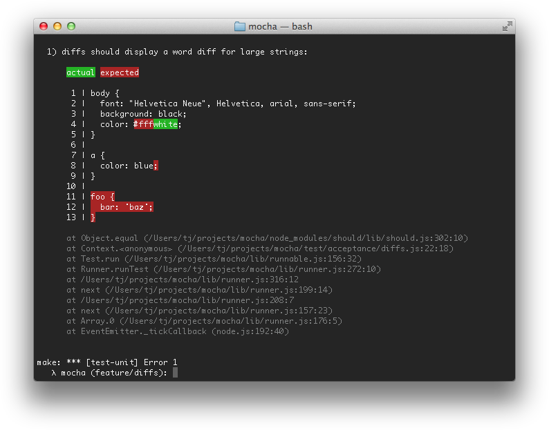
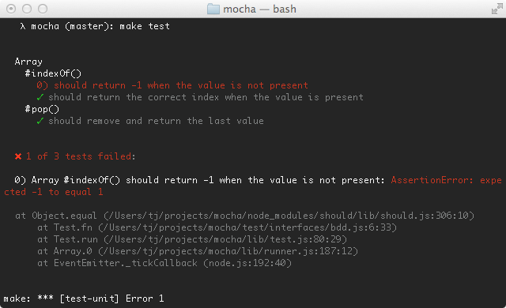
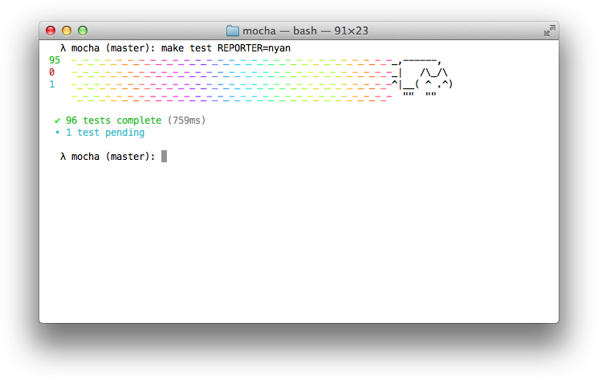
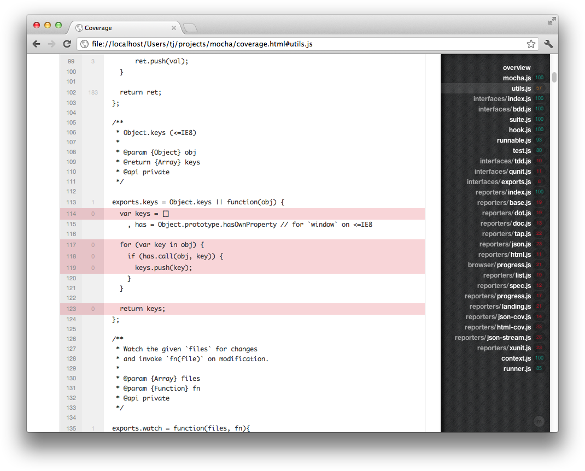
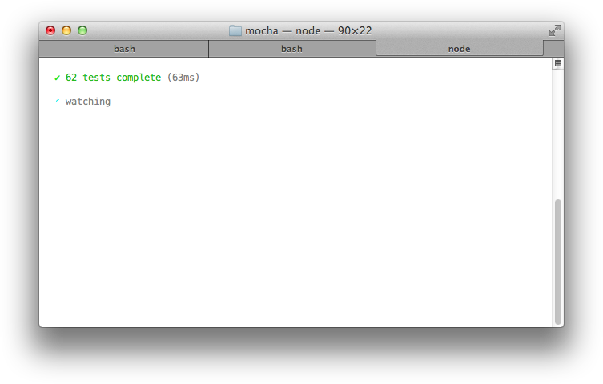

Mocha is a feature-rich JavaScript test framework running on [node.js](http://nodejs.org) and the browser, making asynchronous testing simple and fun. Mocha tests run serially, allowing for flexible and accurate reporting, while mapping uncaught exceptions to the correct test cases. Hosted on [GitHub](https://github.com/mochajs/mocha).

<h2 id="features">Features</h2>

  - browser support
  - simple async support, including promises
  - test coverage reporting
  - string diff support
  - javascript API for running tests
  - proper exit status for CI support etc
  - auto-detects and disables coloring for non-ttys
  - maps uncaught exceptions to the correct test case
  - async test timeout support
  - test-specific timeouts
  - growl notification support
  - reports test durations
  - highlights slow tests
  - file watcher support
  - global variable leak detection
  - optionally run tests that match a regexp
  - auto-exit to prevent "hanging" with an active loop
  - easily meta-generate suites & test-cases
  - mocha.opts file support
  - clickable suite titles to filter test execution
  - node debugger support
  - detects multiple calls to `done()`
  - use any assertion library you want
  - extensible reporting, bundled with 9+ reporters
  - extensible test DSLs or "interfaces"
  - before, after, before each, after each hooks
  - arbitrary transpiler support (coffee-script etc)
  - TextMate bundle
  - and more!

<h2 id="table-of-contents">Table of contents</h2>

  - [Installation](#installation)
  - [1\. 2\. 3\. Mocha!](#getting-started)
  - [Assertions](#assertions)
  - [Synchronous code](#synchronous-code)
  - [Asynchronous code](#asynchronous-code)
  - [Hooks](#hooks)
  - [Pending tests](#pending-tests)
  - [Exclusive tests](#exclusive-tests)
  - [Inclusive tests](#inclusive-tests)
  - [Meta-Generated tests](#meta-generated-test)
  - [Test duration](#test-duration)
  - [String diffs](#string-diffs)
  - [mocha(1)](#usage)
  - [Interfaces](#interfaces)
  - [Reporters](#reporters)
  - [Browser support](#browser-support)
  - [mocha.opts](#mocha.opts)
  - [Suite specific timeouts](#suite-specific-timeouts)
  - [Test specific timeouts](#test-specific-timeouts)
  - [Best practices](#best-practices)
  - [Editors](#editors)
  - [Example test suites](#example-test-suites)
  - [Running mocha's tests](#running-mochas-tests)
  - [More information](#more-information)

<h2 id="installation">Installation</h2>

  Install with [npm](http://npmjs.org):

    $ npm install -g mocha

<h2 id="getting-started">1. 2. 3. Mocha!</h2>

    $ npm install -g mocha
    $ mkdir test
    $ $EDITOR test/test.js

    var assert = require("assert")
    describe('Array', function(){
      describe('#indexOf()', function(){
        it('should return -1 when the value is not present', function(){
          assert.equal(-1, [1,2,3].indexOf(5));
          assert.equal(-1, [1,2,3].indexOf(0));
        })
      })
    })

    $  mocha

      .

      ✔ 1 test complete (1ms)

<h2 id="assertions">Assertions</h2>

Mocha allows you to use any assertion library you want, if it throws an error, it will work! This means you can utilize libraries such as [should.js](https://github.com/visionmedia/should.js), node's regular `assert` module, or others. The following is a list of known assertion libraries for node and/or the browser:

  - [should.js](https://github.com/visionmedia/should.js) BDD style shown throughout these docs
  - [expect.js](https://github.com/LearnBoost/expect.js) expect() style assertions
  - [chai](http://chaijs.com/) expect(), assert() and should style assertions
  - [better-assert](https://github.com/visionmedia/better-assert) c-style self-documenting assert()

<h2 id="synchronous-code">Synchronous code</h2>

 When testing synchronous code, omit the callback and Mocha will automatically continue on to the next test.

    describe('Array', function(){
      describe('#indexOf()', function(){
        it('should return -1 when the value is not present', function(){
          [1,2,3].indexOf(5).should.equal(-1);
          [1,2,3].indexOf(0).should.equal(-1);
        })
      })
    })

<h2 id="asynchronous-code">Asynchronous code</h2>

Testing asynchronous code with Mocha could not be simpler! Simply invoke the callback when your test is complete. By adding a callback (usually named `done`) to `it()` Mocha will know that it should wait for completion.

    describe('User', function(){
      describe('#save()', function(){
        it('should save without error', function(done){
          var user = new User('Luna');
          user.save(function(err){
            if (err) throw err;
            done();
          });
        })
      })
    })

 To make things even easier, the `done()` callback accepts an error, so we may use this directly:

    describe('User', function(){
      describe('#save()', function(){
        it('should save without error', function(done){
          var user = new User('Luna');
          user.save(done);
        })
      })
    })

  All "hooks", that is `before()`, `after()`, `beforeEach()`, `afterEach()` may be sync or async as well, behaving much like a regular test-case. For example you may wish to populate database with dummy content before each test:

    describe('Connection', function(){
      var db = new Connection
        , tobi = new User('tobi')
        , loki = new User('loki')
        , jane = new User('jane');

      beforeEach(function(done){
        db.clear(function(err){
          if (err) return done(err);
          db.save([tobi, loki, jane], done);
        });
      })

      describe('#find()', function(){
        it('respond with matching records', function(done){
          db.find({ type: 'User' }, function(err, res){
            if (err) return done(err);
            res.should.have.length(3);
            done();
          })
        })
      })
    })

  Alternately, instead of using the `done()` callback, you can return a promise. This is useful if the APIs you are testing return promises instead of taking callbacks:

    beforeEach(function(){
      return db.clear().then(function() {
        return db.save([tobi, loki, jane]);
      });
    })

    describe('#find()', function(){
      it('respond with matching records', function(){
        return db.find({ type: 'User' }).should.eventually.have.length(3);
      })
    })

  (The latter example uses [Chai as Promised](https://github.com/domenic/chai-as-promised/) for fluent promise assertions.)

  Note that you may also pick any file and add "root" level hooks, for example add `beforeEach()` outside of `describe()`s then the callback will run before any test-case regardless of the file its in. This is because Mocha has a root `Suite` with no name.

    beforeEach(function(){
      console.log('before every test')
    })

<h2 id="hooks">Hooks</h2>

  Mocha provides the hooks `before()`, `after()`, `beforeEach()`, `afterEach()`,
  that can be used to set up preconditions and clean up your tests.

    describe('hooks', function() {
      before(function() {
        // runs before all tests in this block
      })
      after(function(){
        // runs after all tests in this block
      })
      beforeEach(function(){
        // runs before each test in this block
      })
      afterEach(function(){
        // runs after each test in this block
      })
      // test cases
    })

  All hooks can be invoked with an optional description, making it easier to pinpoint errors in your tests.
  If hooks are given named functions those names will be used if no description is supplied.

    beforeEach(function(){
      // beforeEach hook
    })
    beforeEach(function namedFun() {
      // beforeEach:namedFun
    })
    beforeEach('some description', function(){
      // beforeEach:some description
    })

<h2 id="pending-tests">Pending tests</h2>

  Pending test-cases are simply those without a callback:

    describe('Array', function(){
      describe('#indexOf()', function(){
        it('should return -1 when the value is not present')
      })
    })

<h2 id="exclusive-tests">Exclusive tests</h2>

 The exclusivity feature allows you to run only the specified suite or test-case
 by appending `.only()` to the call as shown here:

    describe('Array', function(){
      describe.only('#indexOf()', function(){
        ...
      })
    })

  Or a specific test-case:

    describe('Array', function(){
      describe('#indexOf()', function(){
        it.only('should return -1 unless present', function(){

        })

        it('should return the index when present', function(){

        })
      })
    })

  Note that currently only one `.only()` call is respected, this
  effectively turns into a `--grep`.

<h2 id="inclusive-tests">Inclusive tests</h2>

 This feature is similar to `.only()`, however by appending `.skip()`
 you may tell Mocha to simply ignore these suite(s) and test-case(s). This
 puts them in a pending state, and is favoured over commenting out tests
 which you may forget to uncomment.

    describe('Array', function(){
      describe.skip('#indexOf()', function(){
        ...
      })
    })

  Or a specific test-case:

    describe('Array', function(){
      describe('#indexOf()', function(){
        it.skip('should return -1 unless present', function(){

        })

        it('should return the index when present', function(){

        })
      })
    })

<h2 id="meta-generated-test">Meta-Generated tests</h2>

 Given mocha's use of call statements and function expressions to define
 suites and specs, it's rather straightforward to generate your tests. No
 special syntax is required - plain JavaScript can be used to achieve
 similar functionality as parameterized tests in other test frameworks.
 Take the following example:

    var assert = require('assert');

    function add() {
      return Array.prototype.slice.call(arguments).reduce(function(prev, curr) {
        return prev + curr;
      }, 0);
    }

    describe('add()', function() {
      var tests = [
        {args: [1, 2],       expected: 3},
        {args: [1, 2, 3],    expected: 6},
        {args: [1, 2, 3, 4], expected: 10}
      ];

      tests.forEach(function(test) {
        it('correctly adds ' + test.args.length + ' args', function() {
          var res = add.apply(null, test.args);
          assert.equal(res, test.expected);
        });
      });
    });

 The code above will output a suite with three specs:

    add()
      ✓ correctly adds 2 args
      ✓ correctly adds 3 args
      ✓ correctly adds 4 args

<h2 id="test-duration">Test duration</h2>

  Most of the reporters support some form of displaying
  test duration, as well as flagging tests that are slow,
  as shown here with the "spec" reporter:

   

<h2 id="string-diffs">String diffs</h2>

  Mocha supports the `err.expected`, and `err.actual` properties
  when available to present expectations to the developer. Currently
  Mocha provides string diffs, however in the future object diffs and
  others may be provided.

  

<h2 id="usage">mocha(1)</h2>

    Usage: mocha [debug] [options] [files]

    Commands:

      init <path>
      initialize a client-side mocha setup at <path>

    Options:

     -h, --help                              output usage information
     -V, --version                           output the version number
     -A, --async-only                        force all tests to take a callback (async)
     -c, --colors                            force enabling of colors
     -C, --no-colors                         force disabling of colors
     -G, --growl                             enable growl notification support
     -O, --reporter-options <k=v,k2=v2,...>  reporter-specific options
     -R, --reporter <name>                   specify the reporter to use
     -S, --sort                              sort test files
     -b, --bail                              bail after first test failure
     -d, --debug                             enable node's debugger, synonym for node --debug
     -g, --grep <pattern>                    only run tests matching <pattern>
     -f, --fgrep <string>                    only run tests containing <string>
     -gc, --expose-gc                        expose gc extension
     -i, --invert                            inverts --grep and --fgrep matches
     -r, --require <name>                    require the given module
     -s, --slow <ms>                         "slow" test threshold in milliseconds [75]
     -t, --timeout <ms>                      set test-case timeout in milliseconds [2000]
     -u, --ui <name>                         specify user-interface (bdd|tdd|exports)
     -w, --watch                             watch files for changes
     --check-leaks                           check for global variable leaks
     --compilers <ext>:<module>,...          use the given module(s) to compile files
     --debug-brk                             enable node's debugger breaking on the first line
     --delay                                 wait for async suite definition
     --es_staging                            enable all staged features
     --full-trace                            display the full stack trace
     --globals <names>                       allow the given comma-delimited global [names]
     --harmony                               enable all harmony features (except typeof)
     --harmony-collections                   enable harmony collections (sets, maps, and weak maps)
     --harmony-generators                    enable harmony generators
     --harmony-proxies                       enable harmony proxies
     --harmony_arrow_functions               enable "harmony arrow functions" (iojs)
     --harmony_classes                       enable "harmony classes" (iojs)
     --harmony_proxies                       enable "harmony proxies" (iojs)
     --harmony_shipping                      enable all shipped harmony fetaures (iojs)
     --inline-diffs                          display actual/expected differences inline within each string
     --interfaces                            display available interfaces
     --no-deprecation                        silence deprecation warnings
     --no-exit                               require a clean shutdown of the event loop: mocha will not call process.exit
     --no-timeouts                           disables timeouts, given implicitly with --debug
     --opts <path>                           specify opts path
     --prof                                  log statistical profiling information
     --recursive                             include sub directories
     --reporters                             display available reporters
     --throw-deprecation                     throw an exception anytime a deprecated function is used
     --trace                                 trace function calls
     --trace-deprecation                     show stack traces on deprecations
     --watch-extensions <ext>,...            additional extensions to monitor with --watch

<h3 id="watch-option">-w, --watch</h3>

  Executes tests on changes to JavaScript in the CWD, and once initially.

<h3 id="compilers-option">--compilers</h3>

  coffee-script is no longer supported out of the box. CS and similar transpilers
  may be used by mapping the file extensions (for use with --watch) and the module
  name. For example `--compilers coffee:coffee-script` with CoffeeScript 1.6- or
  `--compilers coffee:coffee-script/register` with CoffeeScript 1.7+.

<h3 id="bail-option">-b, --bail</h3>

  Only interested in the first exception? use `--bail` !

<h3 id="debug-option">-d, --debug</h3>

  Enables node's debugger support, this executes your script(s) with `node debug <file ...>` allowing you to step through code and break with the `debugger` statement. Note the difference between `mocha debug` and `mocha --debug`: `mocha debug` will fire up node's built-in debug client, `mocha --debug` will allow you to use a different interface — such as the Blink Developer Tools.

<h3 id="globals-option">--globals &lt;names&gt;</h3>

  Accepts a comma-delimited list of accepted global variable names. For example, suppose your app deliberately exposes a global named `app` and `YUI`, you may want to add `--globals app,YUI`. It also accepts wildcards. You could do `--globals '*bar'` and it would match `foobar`, `barbar`, etc. You can also simply pass in `'*'` to ignore all globals.

<h3 id="ignore-leaks-option">--check-leaks</h3>

  By default Mocha will not check for global variables leaked while running tests, to enable this pass `--check-leaks`, to specify globals that are acceptable use `--globals`, for example `--globals jQuery,MyLib`.

<h3 id="require-option">-r, --require &lt;name&gt;</h3>

  The `--require` option is useful for libraries such as [should.js](https://github.com/visionmedia/should.js), so you may simply `--require should` instead of manually invoking `require('should')` within each test file. Note that this works well for `should` as it augments `Object.prototype`, however if you wish to access a module's exports you will have to require them, for example `var should = require('should')`. Furthermore, it can be used with relative paths, e.g. `--require ./test/helper.js`

<h3 id="ui-option">-u, --ui &lt;name&gt;</h3>

  The `--ui` option lets you specify the interface to use, defaulting to "bdd".

<h3 id="reporter-option">-R, --reporter &lt;name&gt;</h3>

  The `--reporter` option allows you to specify the reporter that will be used, defaulting to "dot". This flag may also be used to utilize third-party reporters. For example if you `npm install mocha-lcov-reporter` you may then do `--reporter mocha-lcov-reporter`.

<h3 id="timeout-option">-t, --timeout &lt;ms&gt;</h3>

  Specifies the test-case timeout, defaulting to 2 seconds. To override you may pass the timeout in milliseconds, or a value with the `s` suffix, ex: `--timeout 2s` or `--timeout 2000` would be equivalent.

<h3 id="slow-option">-s, --slow &lt;ms&gt;</h3>

  Specify the "slow" test threshold, defaulting to 75ms. Mocha uses this to highlight test-cases that are taking too long.

<h3 id="grep-option">-g, --grep &lt;pattern&gt;</h3>

  The `--grep` option when specified will trigger mocha to only run tests matching the given `pattern` which is internally compiled to a `RegExp`.

  Suppose for example you have "api" related tests, as well as "app" related tests, as shown in the following snippet; One could use `--grep api` or `--grep app` to run one or the other. The same goes for any other part of a suite or test-case title, `--grep users` would be valid as well, or even `--grep GET`.

    describe('api', function(){
      describe('GET /api/users', function(){
        it('respond with an array of users')
      })
    })

    describe('app', function(){
      describe('GET /users', function(){
        it('respond with an array of users')
      })
    })

<h2 id="interfaces">Interfaces</h2>

  Mocha "interface" system allows developers to choose their style of DSL. Shipping with __BDD__, __TDD__, and __exports__ flavoured interfaces.

<h3 id="bdd-interface">BDD</h3>

  The "__BDD__" interface provides `describe()`, `context()`, `it()`, `before()`, `after()`, `beforeEach()`, and `afterEach()`:

  `context()` is just an alias for `describe()`, and behaves the same way; it just provides a way to keep tests easier to read and organized.

    describe('Array', function(){
      before(function(){
        // ...
      });

      describe('#indexOf()', function(){
        context('when not present', function(){
          it('should not throw an error', function(){
            (function(){
              [1,2,3].indexOf(4);
            }).should.not.throw();
          });
          it('should return -1', function(){
            [1,2,3].indexOf(4).should.equal(-1);
          });
        });
        context('when present', function(){
          it('should return the index where the element first appears in the array', function(){
            [1,2,3].indexOf(3).should.equal(2);
          });
        });
      });
    });

<h3 id="tdd-interface">TDD</h3>

  The "__TDD__" interface provides `suite()`, `test()`, `suiteSetup()`, `suiteTeardown()`, `setup()`, and `teardown()`.

    suite('Array', function(){
      setup(function(){
        // ...
      });

      suite('#indexOf()', function(){
        test('should return -1 when not present', function(){
          assert.equal(-1, [1,2,3].indexOf(4));
        });
      });
    });

<h3 id="exports-interface">Exports</h3>

  The "__exports__" interface is much like Mocha's predecessor [expresso](https://github.com/visionmedia/expresso). The keys `before`, `after`, `beforeEach`, and `afterEach` are special-cased, object values
  are suites, and function values are test-cases.

    module.exports = {
      before: function(){
        // ...
      },

      'Array': {
        '#indexOf()': {
          'should return -1 when not present': function(){
            [1,2,3].indexOf(4).should.equal(-1);
          }
        }
      }
    };

<h3 id="qunit-interface">QUnit</h3>

  The qunit-inspired interface matches the "flat" look of QUnit where the test suite title is simply defined before the test-cases. Like TDD, it uses `suite()` and `test()`, but resembling BDD it also contains `before()`, `after()`, `beforeEach()`, and `afterEach()`.

    function ok(expr, msg) {
      if (!expr) throw new Error(msg);
    }

    suite('Array');

    test('#length', function(){
      var arr = [1,2,3];
      ok(arr.length == 3);
    });

    test('#indexOf()', function(){
      var arr = [1,2,3];
      ok(arr.indexOf(1) == 0);
      ok(arr.indexOf(2) == 1);
      ok(arr.indexOf(3) == 2);
    });

    suite('String');

    test('#length', function(){
      ok('foo'.length == 3);
    });

<h3 id="require-interface">Require</h3>

  The `require` interface allows you to require the `describe` and friend words
  directly using `require` and call them whatever you want. This interface
  is also useful if you want to avoid global variables in your tests.

  Note this works when you run your tests via the `mocha` executable only, and not when using the `node` executable directly. The reason is that
  certain methods are exposed at runtime and when using the `mocha` executable only.

    var testCase = require('mocha').describe
    var pre = require('mocha').before
    var assertions = require('mocha').it
    var assert = require('assert')

    testCase('Array', function(){
      pre(function(){
        // ...
      });

      testCase('#indexOf()', function(){
        assertions('should return -1 when not present', function(){
          assert.equal([1,2,3].indexOf(4), -1);
        });
      });
    });

<h2 id="reporters">Reporters</h2>

  Mocha reporters adjust to the terminal window,
  and always disable ansi-escape colouring when
  the stdio streams are not associated with a tty.

<h3 id="dot-matrix-reporter">Dot Matrix</h3>

  The "dot" matrix reporter is simply a series of dots
  that represent test cases, failures highlight in red,
  pending in blue, slow as yellow.

   

<h3 id="spec-reporter">Spec</h3>

  The "spec" reporter outputs a hierarchical view
  nested just as the test cases are.

   
   

<h3 id="nyan-reporter">Nyan</h3>

  The "nyan" reporter is exactly what you might expect:

  

<h3 id="tap-reporter">TAP</h3>

  The TAP reporter emits lines for a [Test-Anything-Protocol](http://en.wikipedia.org/wiki/Test_Anything_Protocol) consumer.

  

<h3 id="landing-strip-reporter">Landing Strip</h3>

  The Landing Strip reporter is a gimmicky test reporter simulating
  a plane landing :) unicode ftw

  
  

<h3 id="list-reporter">List</h3>

  The "List" reporter outputs a simple specifications list as
  test cases pass or fail, outputting the failure details at
  the bottom of the output.

  

<h3 id="progress-reporter">Progress</h3>

  The progress reporter implements a simple progress-bar:

  

<h3 id="json-reporter">JSON</h3>

  The JSON reporter outputs a single large JSON object when
  the tests have completed (failures or not).

  

<h3 id="json-stream-reporter">JSON Stream</h3>

  The JSON Stream reporter outputs newline-delimited JSON "events" as they occur, beginning with a "start" event, followed by test passes or failures, and then the final "end" event.

  

<h3 id="jsoncov-reporter">JSONCov</h3>

  The JSONCov reporter is similar to the JSON reporter, however when run against a library instrumented by [node-jscoverage](https://github.com/visionmedia/node-jscoverage) it will produce coverage output.

<h3 id="htmlcov-reporter">HTMLCov</h3>

  The HTMLCov reporter extends the JSONCov reporter. The library being tested should first be instrumented by [node-jscoverage](https://github.com/visionmedia/node-jscoverage), this allows Mocha to capture the coverage information necessary to produce a single-page HTML report.

  Click to view the current [Express test coverage](coverage.html) report. For an integration example view the mocha test coverage support [commit](https://github.com/visionmedia/express/commit/b6ee5fafd0d6c79cf7df5560cb324ebee4fe3a7f) for Express.

  

<h3 id="min-reporter">Min</h3>

  The "min" reporter displays the summary only, while still outputting errors
  on failure. This reporter works great with `--watch` as it clears the terminal
  in order to keep your test summary at the top.

  

<h3 id="doc-reporter">Doc</h3>

 The "doc" reporter outputs a hierarchical HTML body representation
 of your tests, wrap it with a header, footer, some styling and you
 have some fantastic documentation!

  

 For example suppose you have the following JavaScript:

    describe('Array', function(){
      describe('#indexOf()', function(){
        it('should return -1 when the value is not present', function(){
          [1,2,3].indexOf(5).should.equal(-1);
          [1,2,3].indexOf(0).should.equal(-1);
        })
      })
    })

 The command `mocha --reporter doc array` would yield:

    <section class="suite">
      <h1>Array</h1>
      <dl>
        <section class="suite">
          <h1>#indexOf()</h1>
          <dl>
          <dt>should return -1 when the value is not present</dt>
          <dd><pre><code>[1,2,3].indexOf(5).should.equal(-1);
    [1,2,3].indexOf(0).should.equal(-1);</code></pre></dd>
          </dl>
        </section>
      </dl>
    </section>

  The SuperAgent request library [test documentation](http://visionmedia.github.io/superagent/docs/test.html) was generated with Mocha's doc reporter using this simple make target:

    test-docs:
    	make test REPORTER=doc \
    		| cat docs/head.html - docs/tail.html \
    		> docs/test.html

  View the entire [Makefile](https://github.com/visionmedia/superagent/blob/master/Makefile) for reference.

<h3 id="xunit-reporter">XUnit</h3>

   Documentation needed.

<h3 id="teamcity-reporter">TeamCity</h3>

   Documentation needed.

<h3 id="markdown-reporter">Markdown</h3>

  The "markdown" reporter generates a markdown TOC and body for your
  test suite. This is great if you want to use the tests as documentation
  within a Github wiki page, or a markdown file in the repository that
  Github can render. For example here is the Connect [test output](https://github.com/senchalabs/connect/blob/90a725343c2945aaee637e799b1cd11e065b2bff/tests.md).

<h3 id="html-reporter">HTML</h3>

 The __HTML__ reporter is currently the only browser reporter
 supported by Mocha, and it looks like this:

 

<h2 id="browser-support">Browser support</h2>

 Mocha runs in the browser. Every release of Mocha will have new builds of _./mocha.js_ and _./mocha.css_ for use in the browser. To setup Mocha for browser use all you have to do is include the script, stylesheet, tell Mocha which interface you wish to use, and then run the tests. A typical setup might look something like the following, where we call `mocha.setup('bdd')` to use the __BDD__ interface before loading the test scripts, running them `onload` with `mocha.run()`.

    <html>
    <head>
      <meta charset="utf-8">
      <title>Mocha Tests</title>
      <link rel="stylesheet" href="mocha.css" />
    </head>
    <body>
      

      
      
      
      
      
      
      
      
    </body>
    </html>

<h3 id="grep-query">grep</h3>

  The client-side may use `--grep` as well, however, you must append a query-string to your URL: `?grep=api`.

<h3 id="browser-setup">Mocha Setup in the Browser</h3>

  Mocha options can be set via `mocha.setup()`.  Examples:

    // Use "tdd" interface.  This is a shortcut to setting the interface;
    // any other options must be passed via an object.
    mocha.setup('tdd');

    // This is equivalent to the above.
    mocha.setup({
      ui: 'tdd'
    });

    // Use "tdd" interface, ignore leaks, and force all tests to be asynchronous
    mocha.setup({
      ui: 'tdd',
      ignoreLeaks: true,
      asyncOnly: true
    });

<h3 id="browser-specific-options">Browser-specific option(s)</h3>

  The following option(s) *only* function in a browser context:

  `noHighlighting` : If set to `true`, do not attempt to use syntax highlighting on output test code.

<h3 id="browser-specific-methods">Browser-specific method(s)</h3>

  The following method(s) <em>only</em> function in a browser context:

  `mocha.allowUncaught()` : If called, uncaught errors will not be absorbed by the error handler.

<h2 id="mocha.opts">mocha.opts</h2>

 Mocha will attempt to load `./test/mocha.opts`, these are concatenated with `process.argv`, though command-line args will take precedence. For example suppose you have the following _mocha.opts_ file:

    --require should
    --reporter dot
    --ui bdd

  This will default the reporter to `dot`, require the `should` library,
  and use `bdd` as the interface. With this you may then invoke `mocha(1)`
  with additional arguments, here enabling growl support and changing
  the reporter to `list`:

    $ mocha --reporter list --growl

<h2 id="suite-specific-timeouts">Suite specific timeouts</h2>

  Suite-level timeouts may be applied to entire test "suites", or disabled
  via `this.timeout(0)`. This will be inherited by all nested suites and test-cases
  that do not override the value.

    describe('a suite of tests', function(){
      this.timeout(500);

      it('should take less than 500ms', function(done){
        setTimeout(done, 300);
      })

      it('should take less than 500ms as well', function(done){
        setTimeout(done, 200);
      })
    })

<h2 id="test-specific-timeouts">Test specific timeouts</h2>

  Test-specific timeouts may also be applied, or the use of `this.timeout(0)`
  to disable timeouts all together:

    it('should take less than 500ms', function(done){
      this.timeout(500);
      setTimeout(done, 300);
    })

<h2 id="best-practices">Best practices</h2>

<h3 id="test-directory">test/*</h3>

 By default `mocha(1)` will use the pattern `./test/*.js`, so
 it's usually a good place to put your tests.

<h3 id="makefiles">Makefiles</h3>

 Be kind and don't make developers hunt around in your docs to figure
 out how to run the tests, add a `make test` target to your _Makefile_:

    test:
        ./node_modules/.bin/mocha --reporter list

    .PHONY: test

<h2 id="editors">Editors</h2>

  The following editor-related packages are available:

<h3 id="textmate-bundle">TextMate bundle</h3>

  The Mocha TextMate bundle includes snippets to
  make writing tests quicker and more enjoyable.
  To install the bundle run:

    $ make tm

<h3 id="jetbrains-plugin">JetBrains plugin</h3>

  [JetBrains](http://jetbrains.com) provides a [NodeJS plugin](http://www.jetbrains.com/idea/features/nodejs.html) for its suite of IDEs (IntelliJ IDEA, WebStorm, etc.), which contains a Mocha test runner, among other things.

  

  The plugin is titled **NodeJS**, and can be installed via **Preferences** > **Plugins**, or via [direct download](http://plugins.jetbrains.com/plugin/6098?pr=phpStorm).

<h2 id="example-test-suites">Example test suites</h2>

  The following test suites are from real projects putting Mocha to use,
  so they serve as good examples:

   - [Express](https://github.com/visionmedia/express/tree/master/test)
   - [Connect](https://github.com/senchalabs/connect/tree/master/test)
   - [SuperAgent](https://github.com/visionmedia/superagent/tree/master/test/node)
   - [WebSocket.io](https://github.com/LearnBoost/websocket.io/tree/master/test)
   - [Mocha](https://github.com/mochajs/mocha/tree/master/test)

<h2 id="running-mochas-tests">Running mocha's tests</h2>

 Run the tests:

    $ make test

 Run all tests, including interfaces:

    $ make test-all

 Alter the reporter:

    $ make test REPORTER=list

<h2 id="more-information">More information</h2>

  For additional information such as using spies, mocking, and shared behaviours be sure to check out the [Mocha Wiki](https://github.com/mochajs/mocha/wiki) on GitHub. For discussions join the [Google Group](http://groups.google.com/group/mochajs). For a running example of mocha view [example/tests.html](example/tests.html). For the JavaScript API view the [source](https://github.com/mochajs/mocha/blob/master/lib/mocha.js#L51).
